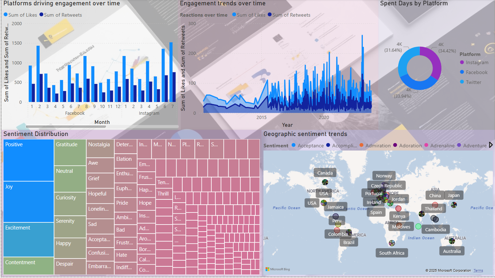
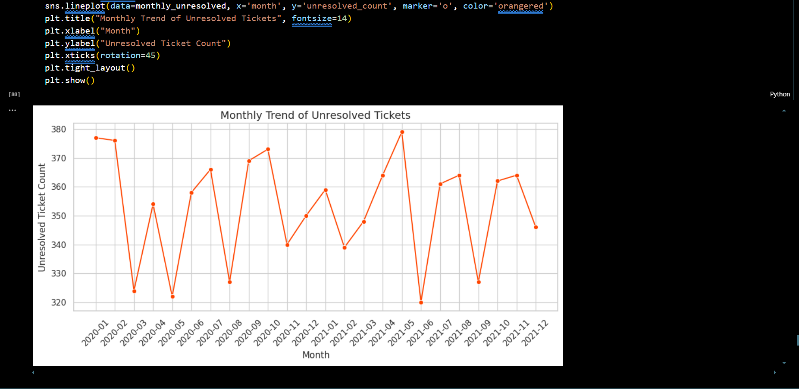
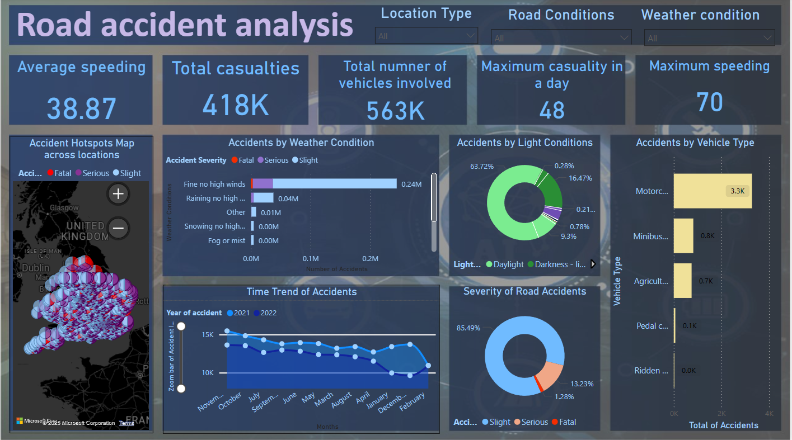

# FUTURE_DS_01

  
  
  

<h1 align="center">📊 Data Analytics Portfolio</h1>

Transforming raw data into real-world insights with Python, Power BI, and storytelling dashboards.

---

## 🚀 About This Repository

This repository features **three end-to-end data analysis projects** that showcase my ability to derive business insights from real-world datasets. From social behavior to customer support and public safety — each project solves a meaningful problem with data, analytics, and visualization.

---

## 📁 Project Showcase

### 🌐 1. Social Media Trend Analysis

📄 [Read Report](./Social-media-trend-analysis/SocialMediaTrendAnalysisReport.pdf)  
📊 **Tools**: Python (TextBlob, Pandas), Power BI, Excel

**✨ Highlights**:
- Analyzed **Twitter, Instagram, Facebook** posts for sentiment, engagement, and hashtags.
- Instagram has the **most positive sentiment**, while Twitter has more **negative discussions**.
- Identified **influencers** and content types that drive virality.
- Visualized **sentiment spikes** around events for crisis and reputation management.

> 💡 _Great for roles involving social listening, trend forecasting, or marketing analytics._

---

### 🎟️ 2. Customer Support Data Analysis

📄 [Read Report](./Customer-satisfaction-analysis/Customer_Support_Analysis_Report.pdf)  
📊 **Tools**: Python (Pandas, NLTK, Seaborn), Power BI

**✨ Highlights**:
- Explored **ticket volume, resolution time**, and **customer satisfaction** trends.
- Built a **frustration heatmap** to detect bottlenecks in support workflow.
- Applied **NLP** to extract keywords from low-rated complaints.
- Suggested improvements like **faster response automation** and sentiment-based ticket tagging.

> 💡 _Perfect for data-driven customer experience roles or support optimization consulting._

---

### 🚧 3. Road Accident Analysis Dashboard

📄 [Read Report](./Road-accident-analysis/Road_Accident_Analysis_Report.pdf)  
📊 **Tools**: Power BI (DAX, Filters, Maps), Excel

**✨ Highlights**:
- Mapped **accident hotspots** across the UK using geo-data.
- Identified high-risk areas by **weather, light, and road conditions**.
- Found rural roads had **fewer but more severe** accidents.
- Recommends **infrastructure improvements** like signage, lighting, and awareness campaigns.

> 💡 _Applicable to transportation analytics, government policy, or urban planning jobs._

---

## 📦 Directory Structure

📂 social-media-trend-analysis │ └── SocialMediaTrendAnalysisReport.pdf └── Social-media-trends-dashboard.pbix └── Social_media_trend_analysis.ipynb └── sentimentdataset.csv └── social-media-trend-preview.png

📂 customer-support-analysis │ └── Customer_Support_Analysis_Report.pdf └── Customer_satisfaction_analysis.ipynb └── customer-satisfaction-preview.png └── customer_support_tickets.csv

📂 road-accident-analysis │ └── Road_Accident_Analysis_Report.pdf  └── road-accident-preview.png  └── road-accident-visualization.pbix

---

## 🧠 Skills Demonstrated

- **Data Cleaning & Exploration** (Pandas, Excel)
- **Natural Language Processing** (TextBlob, NLTK)
- **Visualization & Dashboards** (Matplotlib, Power BI, WordCloud)
- **Sentiment & Trend Analysis**
- **Real-World Recommendation Framing**
- **Domain-specific storytelling** for Business, Marketing, and Public Safety

---

## 💼 Why This Portfolio?

📈 Demonstrates **practical experience** with real datasets  
🎯 Shows **problem-solving and domain understanding**  
📊 Highlights **strong visualization and storytelling skills**  
✅ Reflects readiness for roles like **Data Analyst**, **BI Developer**, or **Customer Insight Specialist**

---

## 📫 Let’s Connect!

I'm actively looking for opportunities where I can contribute and grow as a data professional.

- 🔗 [Subha Dhar](https://www.linkedin.com/in/subhadhar/)
- 📧 dharsubha2000@gmail.com
- 💬 Feel free to [open an issue](https://github.com/subha200/FUTURE_DS_01/blob/main/known-issues.txt) if you have questions or feedback!

---

_Thanks for visiting! ⭐ If you like this work, consider giving the repository a star to show support!_

